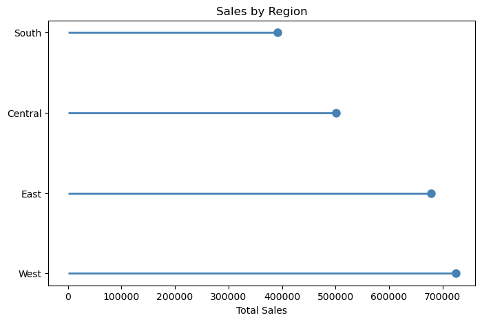
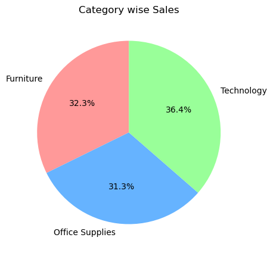
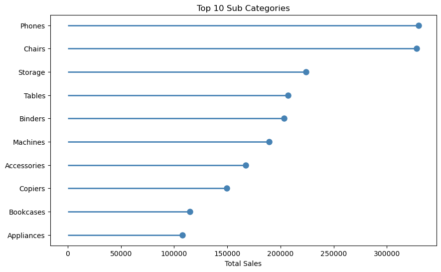
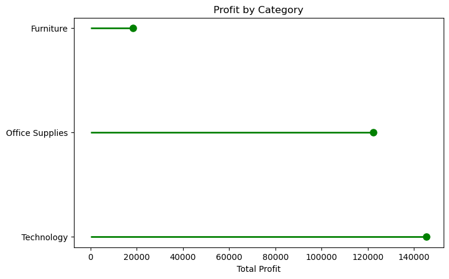
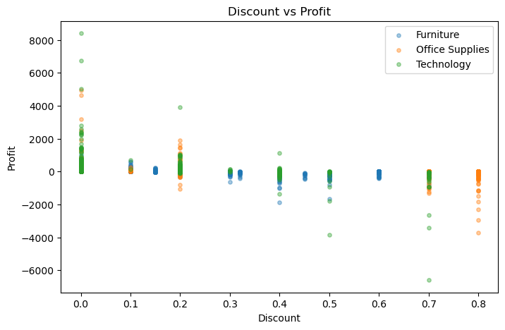

# Superstore Sales Analysis

I did this project to practice data analysis using a retail dataset.
The dataset has sales records of a superstore across different regions
in the US. I wanted to see which regions and products are doing well
and which are not.

## Dataset

Got this dataset from Kaggle. It has around 9977 rows and 13 columns
after I removed the duplicate entries. The main columns I worked with
were Region, Category, Sub-Category, Sales, Profit and Discount.

## Tools

I used Python with Pandas and Matplotlib for the analysis and charts.
Also wrote some SQL queries using SQLite to cross check my findings.
Everything was done in Jupyter Notebook.

## Analysis

First I cleaned the data by removing 17 duplicate rows. Then I looked
at the overall numbers - total sales came to around 2.29 million and
profit was around 286K which gives a margin of 12.47%.

I checked each region separately and found that West has the highest
sales at 725K while South is the lowest at around 391K. Central region
surprised me a bit - it has decent sales but the profit margin is only
7.92% which is quite low compared to others.

For categories, Technology has the best numbers with 836K in sales and
145K in profit. Furniture was interesting - second highest sales at 741K
but profit is only 18K which is very low. Office Supplies sits in between.

I also looked at discounts and found that when discount goes above 40%
the average profit becomes negative. So heavy discounting is actually
hurting the business.

## Charts

### Sales by Region

### Sales by Category

### Top 10 Sub-Categories

### Profit by Category

### Discount vs Profit

## Things I noticed

West and East together make up most of the revenue so those regions
should get more attention. Furniture margins are really bad so either
pricing needs to change or costs need to come down. Phones and Chairs
are the top selling products so pushing those more could help. And
discounts above 40% should probably be stopped since they cause losses.

## How to run

Install pandas matplotlib numpy and then open the notebook in Jupyter
and run all cells. The dataset file should be in the same folder.

## Contact

Bindhusri Madireddy           

bindhusrireddy18@gmail.com

linkedin.com/in/bindhusrireddy18
